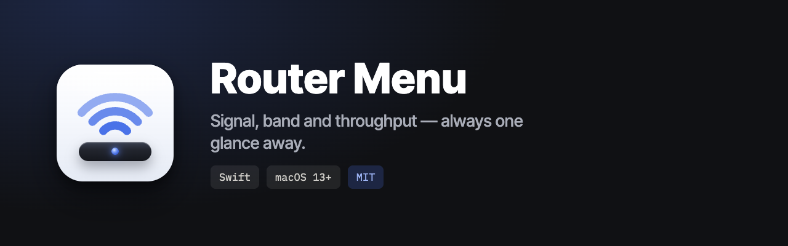
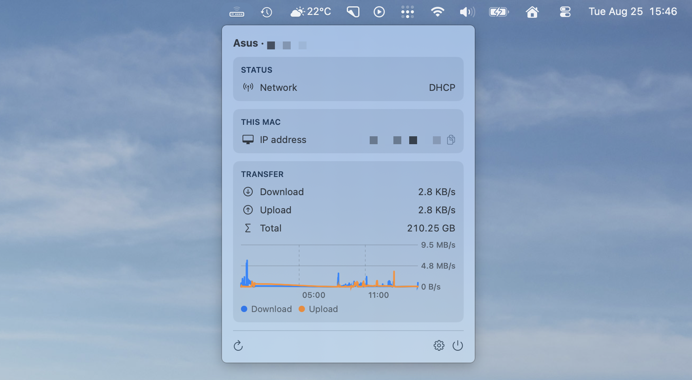

# Router Menu

Keep an eye on your ZTE 5G modem from the macOS menu bar — battery, signal,
and how much data you've used, without opening the modem's web panel.

The icon shows up only while you're actually connected to the modem, and stays
out of the way the rest of the time.

[](https://github.com/RadnoK/router-menu/releases)
[](LICENSE)
[](#requirements)

## How it looks



## Install

```bash
brew tap RadnoK/tap
brew install --cask router-menu
```

Or grab the `.zip` from [Releases](https://github.com/RadnoK/router-menu/releases)
and drag `Router Menu.app` into `/Applications`.

The app is signed and notarized by Apple, so it opens without Gatekeeper
warnings. It runs natively on both Apple Silicon and Intel Macs.

## What you get

**At a glance in the menu bar** — the icon fills up as your signal gets
stronger, so you can tell reception from across the room.

**Click for the details:**

- Battery level, and whether the modem is charging
- Signal strength and network type (5G, LTE, …)
- Current up and down speed
- Data used this month and in total
- How long the connection has been up
- Small charts of battery and data over the last 24 hours

**Optional signal diagnostics** — RSRP and SINR, two numbers the modem reports
that tell you how clean the cellular signal is. Useful when you're hunting for
the best spot to put the modem; easy to ignore otherwise. You can hide them,
along with any other group of stats, in Settings.

**Speaks your language** — English and Polish. Follows your Mac's language, or
you can pick one in Settings.

## Requirements

- macOS 14 or newer
- A ZTE 5G modem with a web panel at `192.168.0.1` — developed against the
  **ZTE U50**, and likely to work with related models that share the same web
  panel. If you try another one, [let me know how it goes](https://github.com/RadnoK/router-menu/issues).

## Setup

Most of it works the moment you install it. Two things are worth knowing.

### Finding your modem

The app needs to know when you're on the modem's network, and there are two
ways it can tell:

- **By Wi-Fi name** — matches your network name. macOS only lets apps read the
  Wi-Fi name if you grant **location** permission, so you'll see that prompt on
  first launch. Nothing about your location is read, sent, or stored; it's just
  the gate macOS puts in front of the network name.
- **By modem address** — checks whether the modem answers at its IP. No
  location permission needed.

Pick whichever you prefer in Settings, under **General**.

### Data counters

Battery, signal, and current speed work right away.

The **monthly** and **total** counters are different: the modem only reports
them to a logged-in session. Put your modem's web panel password into Settings
under **Account**, and the counters start filling in. The password goes into
your macOS keychain and is only ever sent to the modem on your own network.

Don't want to bother? Leave it empty. Everything else keeps working.

## Updates

The app updates itself. You can turn that off, change how often it checks, or
check right now — all under **Updates** in Settings. Updates are
cryptographically signed and verified before anything is installed.

## Privacy

The app talks to your modem and nothing else.

- No analytics, no telemetry, no external servers — all traffic stays on your
  local network.
- Your modem password lives in the macOS keychain.
- The 24-hour history is a local file in
  `~/Library/Application Support/zte-menu/`.
- Location permission, if you grant it, is used for exactly one thing: reading
  your Wi-Fi network name. Your location is never read or transmitted.

## Not seeing the icon?

If you use a menu bar manager like Bartender or Ice, it may have tucked the new
icon into the hidden section. Check there and mark **Router Menu** as always
visible.

Otherwise, remember the icon is hidden by design when you're not connected to
the modem — that's usually the explanation.

## Contributing

Bug reports and pull requests are welcome. If something's broken or your modem
isn't supported, [open an issue](https://github.com/RadnoK/router-menu/issues).

### Building from source

You'll need a Swift 6 toolchain (ships with recent Xcode). There's no Xcode
project — it's a Swift package.

```bash
swift test              # run the test suite (64 tests)
./scripts/build-app.sh  # build and package into a .app
open "dist/Router Menu.app"
```

`build-app.sh` produces a universal binary, assembles the app bundle, and
ad-hoc signs it so it runs locally.

### How it fits together

The code is layered so the interesting parts can be unit tested without a
modem attached: parsing, formatting, state, and history are plain Swift with no
system dependencies, while the pieces that touch the network, the keychain, and
Core Location sit behind thin injected wrappers. SwiftUI views read from an
observable store and stay free of business logic.

Talking to the modem was worked out by watching its own web panel: logging in
hashes the password, and the resulting session cookie is replayed on later
requests. `ModemClient` and `ZTEAuth` hold that logic, and the tests pin it
against captured responses.

### Releasing

Bump the version in `Resources/Info.plist`, then push a matching tag:

```bash
git tag v0.4.0 && git push origin main v0.4.0
```

GitHub Actions takes it from there — builds, signs, notarizes, publishes the
release, updates the appcast, and bumps the Homebrew cask.

## License

[MIT](LICENSE) © Konrad Alfaro
